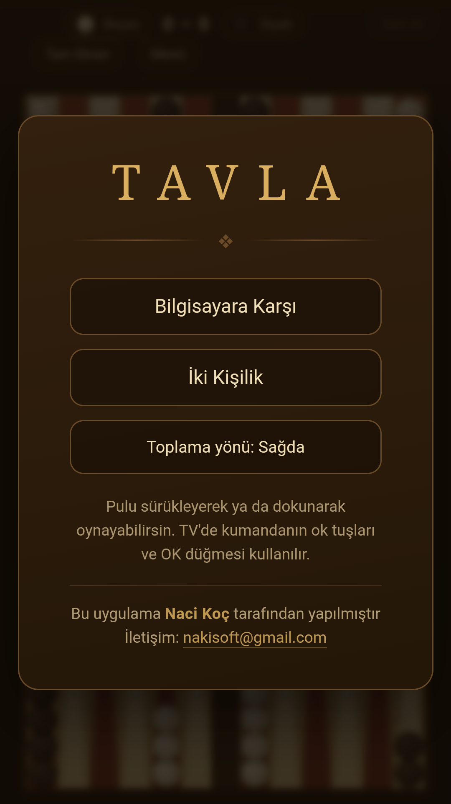
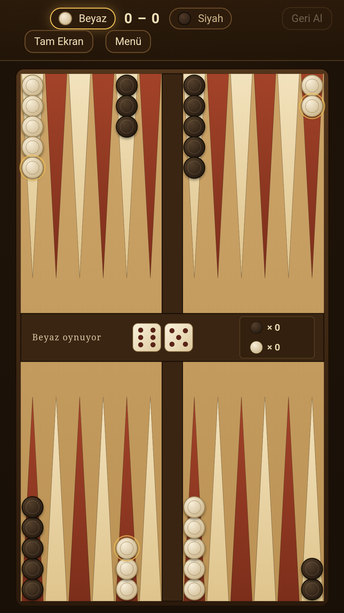
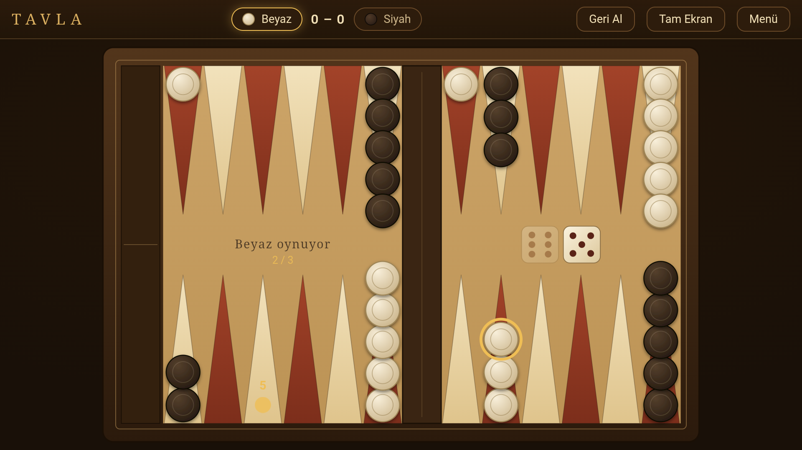

# Tavla

Telefon, tablet ve Android TV'de aynı uygulamayla oynanan tam kurallı tavla.
Oyunun tamamı tek bir HTML dosyası; Android uygulaması bu dosyayı tam ekran bir
WebView içinde açar.

Kurulum boyutu 100 KB'ın altında, **hiçbir izin istemez**, internete hiç
bağlanmaz. Reklam ve uygulama içi satın alma yoktur.

<p align="center">
  
  &nbsp;&nbsp;
  
</p>

<p align="center">
  
</p>

<p align="center">
  <sub>Solda menü ve oyun ekranı (telefon), altta Android TV'de kumandayla
  hamle seçimi: kaynakta halka, hedefte zar değeri, ortada kaçıncı hamlede
  olduğunuzu gösteren sayaç.</sub>
</p>

## Özellikler

- **Tam kurallı tavla** — zar zorunluluğu (mümkünse iki zar da oynanır, yalnızca
  biri oynanabiliyorsa büyük olan tercih edilir), pul kırma ve bar'dan giriş,
  pul toplama, çift zarda dört hamle, mars (2 puan) ve normal galibiyet (1 puan)
- **Bilgisayara karşı ya da iki kişilik** — aynı cihazda karşılıklı oynanır
- **Üç cihaz, tek uygulama** — telefon, tablet ve Android TV
- **Üç ayrı kontrol** — dokunma, sürükle-bırak ve TV kumandası
- **Geri Al** — sıra sizdeyken hamleler adım adım geri alınır
- **Toplama yönü** — menüden sağa/sola çevrilir, tercih hatırlanır
- Pullar kayarak hareket eder, zar sesi vardır, oyun sürerken ekran kararmaz

## Kurulum

> Derlenmiş paketler depoda tutulmaz (`.gitignore`). Aşağıdaki komutla
> üretilirler.

```powershell
.\build.ps1
```

Bu komut `apk/` klasörüne üç dosya bırakır:

| Dosya | Kullanım |
|---|---|
| `apk/Tavla.apk` | Cihaza elden kurulum (imzalı) |
| `apk/Tavla.aab` | Google Play'e yüklenen paket |
| `apk/Tavla-debug.apk` | Geliştirme ve hata ayıklama |

**Telefon ve tablet:** APK'yı cihaza kopyalayın, dosya yöneticisinden dokunun.
Android "bilinmeyen kaynak" uyarısı verirse o uygulama için kurulum iznini açın.

**Android TV / TV box:** TV'de genelde dosya yöneticisi bulunmaz. İki yol var:

- **USB bellek ile:** APK'yı belleğe atın, TV'ye takın, "Send Files to TV"
  benzeri bir uygulamayla açın.
- **Bilgisayardan ADB ile** — TV ve bilgisayar aynı ağda olmalı, TV'de
  *Geliştirici seçenekleri → USB hata ayıklama* açık olmalı:

```bash
adb connect TV_IP_ADRESI:5555
```

```bash
adb install apk/Tavla.apk
```

Kurulduktan sonra uygulama TV ana ekranındaki uygulamalar arasında görünür
(manifest'te `LEANBACK_LAUNCHER` tanımlı).

## Oynanış

### Dokunmatik (telefon, tablet)

- **Dokunarak:** Oynatmak istediğiniz pula dokunun, sonra altın noktayla
  işaretlenen hedefe dokunun.
- **Sürükleyerek:** Pulu tutup hedef haneye bırakın. Geçersiz bir yere
  bırakırsanız pul kendiliğinden yerine döner.
- **Çift dokunuş (kısayol):** Pula çift dokunursanız hamle hemen oynanır; büyük
  zar önce denenir. **Aynı haneye tekrar çift dokunursanız** hamle geri alınıp
  *diğer* olasılığa geçilir — hamleler üst üste binmez. Kaynaktaki kesik çizgili
  halka ve yanındaki `1/2` sayacı kaç seçenek olduğunu ve hangisinde olduğunuzu
  gösterir. Başka bir yere dokununca zincir kapanır; "Geri Al" tek adımda çift
  dokunuş öncesine döner.

### TV kumandası

- **Sağ/sol ok** doğrudan **hamleler** arasında gezer. Ekranda aynı anda
  kaynaktaki halka, hedefteki zar değeri ve kaçıncı hamlede olduğunuzu gösteren
  sayaç görünür.
- **OK** gösterilen hamleyi oynar. Bir sonraki hamle için odak aynı bölgede
  kalır, böylece art arda OK'a basarak hızlıca oynayabilirsiniz.
- **Yukarı ok** üstteki Menü ve Geri Al düğmelerine çıkar, **aşağı ok** tahtaya
  döner. İmleç gezinirken menüye takılmaz.
- **Geri tuşu** seçimi iptal eder; iki kez basınca uygulamadan çıkar.

Çift dokunuş kısayolu kumandada **bilerek yoktur**: hızlı iki OK basışı kazayla
hamle oynamasın diye kısayol yalnızca dokunma/fare yolunda tanınır. Bu yapısal
bir garantidir — klavye yolu `dispatch(act)` fonksiyonunu tek argümanla çağırır,
ikinci argümanı yalnızca tıklama dinleyicisi gönderir.

## Geliştirme

Kaynak oyun dosyası `src/app.html`. Bu dosya HTML iskeleti olmadan yazılır
(Artifact olarak yayınlanabilmesi için); `build.ps1` onu tam bir HTML sayfasına
sarıp `index.html` üretir, APK varlıklarına kopyalar ve paketleri derler.
Sadece tarayıcıda denemek için `index.html` dosyasını açmak yeterlidir.

`index.html` üretilen bir dosyadır — elle düzenlemeyin, `src/app.html` üzerinde
çalışın.

`build.ps1` sayfanın `<head>` bölümünü kendisi yazar ve `src/app.html` dosyasının
ilk iki satırını (başlık ve viewport) atar. Viewport etiketini değiştirmeniz
gerekirse **build.ps1 içindekini** düzenleyin — `viewport-fit=cover` oradan gelir
ve çentikli ekranlarda `env(safe-area-inset-*)` boşluklarının çalışması ona
bağlıdır.

### Tarayıcı uyumluluğu

`minSdk 21` olduğu için oyun eski WebView sürümlerinde de çalışmak zorunda —
test edilen bir Android 11 cihazda WebView 83 çıktı. Bu yüzden sayfada şunlar
**kullanılmaz**: `inset` kısayolu, `margin-inline`, flex `gap`, `dvh` birimi ve
`:focus-visible`'ın `.kbf` ile aynı seçici listesinde yer alması (desteklemeyen
tarayıcı kuralın tamamını düşürür). Bunların yerine sırasıyla
`top/right/bottom/left`, `margin-left/right`, komşu-kardeş kenar boşluğu
(`> * + *`), `@supports` ile korunan `dvh` ve ayrı kurallar kullanılır.

Yeni CSS özelliği eklerken hedef, **Chrome 80** seviyesinde çalışmasıdır.

### Sürükleme sırasında yeniden çizim yapmayın

Sürükleme kodunda kritik bir kısıt var: parmak hareket ederken `render()`
**çağrılmaz**. Tahta `innerHTML` ile baştan kurulduğu için dokunuşun hedef
öğesi DOM'dan sökülür ve tarayıcı `touchmove`/`touchend` olaylarını iletmeyi
keser — sürükleme ortada ölür. Bunun yerine kalkan pul, `data-chk` özniteliğiyle
bulunup `opacity` ile gizlenir.

### Test

Oyun mantığı, WebView'in kendi içinde çalışan bir doğrulama sayfasıyla test
edilebilir: `android/app/src/main/assets/` altına oyunun kopyası + doğrulama
betiğinden oluşan bir `test.html` konur ve MainActivity'ye o sayfayı açan geçici
bir intent ekstrası eklenir. Sonuçlar `adb logcat -s TavlaWV` çıktısına düşer.
(Bu kanca kalıcı kodda yoktur, gerektiğinde eklenir.)

Çift dokunuş akışı bu yolla WebView 83 üzerinde doğrulandı: kural motoru, hamle
döngüsü, kırılan pulun geri gelmesi, zar durumları ve TV yolunun etkilenmediği.

Emülatörün `input tap` komutu iki dokunuş arasına ~1,4 saniye koyduğu için
gerçek bir çift dokunuş üretemez; zamanlama testleri sayfa içinden sentetik
`click` olaylarıyla yapılır. Sürükleme testi için `input swipe` kullanılabilir.

## Proje yapısı

```
src/app.html                 oyunun tamamı (kural motoru, arayüz, yapay zeka)
index.html                   build.ps1 üretir — elle düzenlemeyin
build.ps1                    tek komutluk yapım betiği
apk/                         derlenmiş paketler (depoda tutulmaz)
android/                     Android WebView sarmalayıcı projesi
  app/src/main/java/...      MainActivity — tam ekran WebView, geri tuşu,
                             çentik, TV algılama, mailto yönlendirmesi
  app/src/main/assets/       index.html buraya kopyalanır
  tavla-release.jks          imzalama anahtarı — depoda YOK
  keystore.properties        anahtar yolu ve parolaları — depoda YOK
store/                       Play Console için hazırlıklar
  PLAY-YOL-HARITASI.md       yükleme adımları ve beyan formlarının cevapları
  magaza-metinleri.md        uygulama adı, açıklamalar, sürüm notları
  gizlilik-politikasi.html   gizlilik politikası sayfası
  icon-512.png · feature-1024x500.png · tv-banner-1280x720.png
  screens/                   ekran görüntüleri (telefon 1080×1920, TV 1920×1080)
```

Uygulama kimliği **`com.hilspot.tavla`** — Play'e ilk yüklemeden sonra bir daha
değiştirilemez. Güncel sürüm: **1.4** (versionCode 5).

## İmzalama

Release imzası için iki dosya gerekir ve **ikisi de depoya girmez**:

- `android/tavla-release.jks` — imzalama anahtarı
- `android/keystore.properties` — anahtar yolu, alias ve parolalar

Bu iki dosya yoksa derleme yine çalışır, yalnızca release paketi imzasız çıkar.
Yeni bir bilgisayarda kurarken ikisini de yedeğinizden geri koyun; `build.gradle`
gerisini kendisi halleder.

`keystore.properties` şu dört satırdan oluşur:

```properties
storeFile=../tavla-release.jks
storePassword=...
keyAlias=tavla
keyPassword=...
```

> Anahtarı kaybederseniz uygulamayı Play'de bir daha güncelleyemezsiniz.
> Yedeğini depodan ayrı bir yerde tutun.

## Play Console

Dahili teste çıkarma adımları, beyan formlarının bu uygulama için doğru
cevapları ve geri dönüşü olmayan kararlar
[store/PLAY-YOL-HARITASI.md](store/PLAY-YOL-HARITASI.md) dosyasında.

Play'e yüklenen dosya `apk/Tavla.aab`'dir; `apk/Tavla.apk` yalnızca elden
kurulum ve test içindir.

## İndirme

Kurulabilir paketler depoda tutulmaz; her sürüm
[Releases](https://github.com/nacikoc/tavla/releases) sayfasında yayımlanır.
Kendiniz derlemek isterseniz [Kurulum](#kurulum) bölümüne bakın.

## Lisans

Kaynak kod [MIT lisansı](LICENSE) ile sunulur — istediğiniz gibi kullanabilir,
değiştirebilir ve dağıtabilirsiniz.

Lisansın **kapsamadığı** şeyler: uygulamanın adı (*Tavla — Çevrimdışı Klasik*),
simgesi, öne çıkan görseli ve `store/` altındaki mağaza materyalleri ile
`com.hilspot.tavla` uygulama kimliği. Bunlar uygulamanın kimliğine aittir ve
saklıdır. Kodu temel alan bir sürüm yayımlarsanız kendi adınızı, simgenizi ve
kendi paket adınızı kullanın.

---

Bu uygulama **Naci Koç** tarafından yapılmıştır — <nakisoft@gmail.com>
